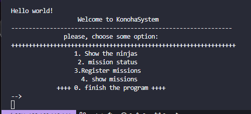
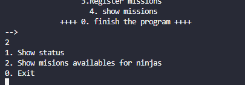

# WELCOME TO KONNOHA SYSTEM!!

## *Welcome to our ninja management program and konoha village missions!*

### We currently have the database design of what the application will be.:

### This system has 4 tables:
1. Ninjas
2. NinjaMissions
3. Missions
4. Ablitys

### The sql was made from this for its correct presentation of FOREIGN KEY, PRIMARY KEY, etc...

### The program consists of showing, adding and deleting missions
### In addition to the fact that you "can" make queries directly to the database, but currently I did not have the understanding capacity to be able to do so, just like with the rest of the things...

### It has a functional menu (not in its entirety) that will guide you to carry out the crud processes for the missions

### It has several sections that I have no idea why they are useless xdd

### If option number one is given, the information within the database would appear, but for the moment there will only be this replacement builder

### If you click on the second option, this secondary menu will appear.

### What it will do is ask you if you want to add, show or delete, or see statuses, etc.

## There is more but how lazy :p

### Use very simple things like getters, setters, constructors, builders, among others.